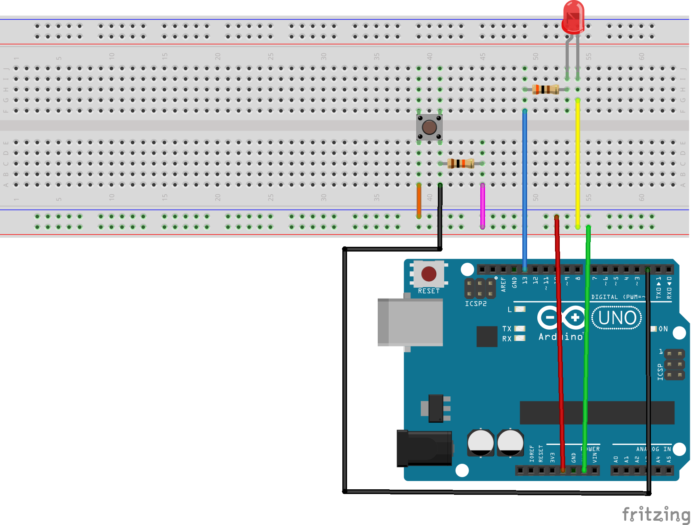

# Led Button

* Componentes principais:
    * 01 Botão e 01 LED.
* Descrição:
    * Conforme você pressiona um botão, um LED é acesso.
* Componentes utilizados:
    * 01 Led Vermelho.
    * 01 Resistor de 300 Ohms.
    * 01 PushButton.
    * 01 Resistor de 10k Ohms.
    * 07 Jumpers.

Trata-se de fazer um botão acender um led quando pressionado e, quando solto, o led deverá apagar. Coloque os componentes como está sendo mostrado na imagem abaixo, bem como suas ligações:

